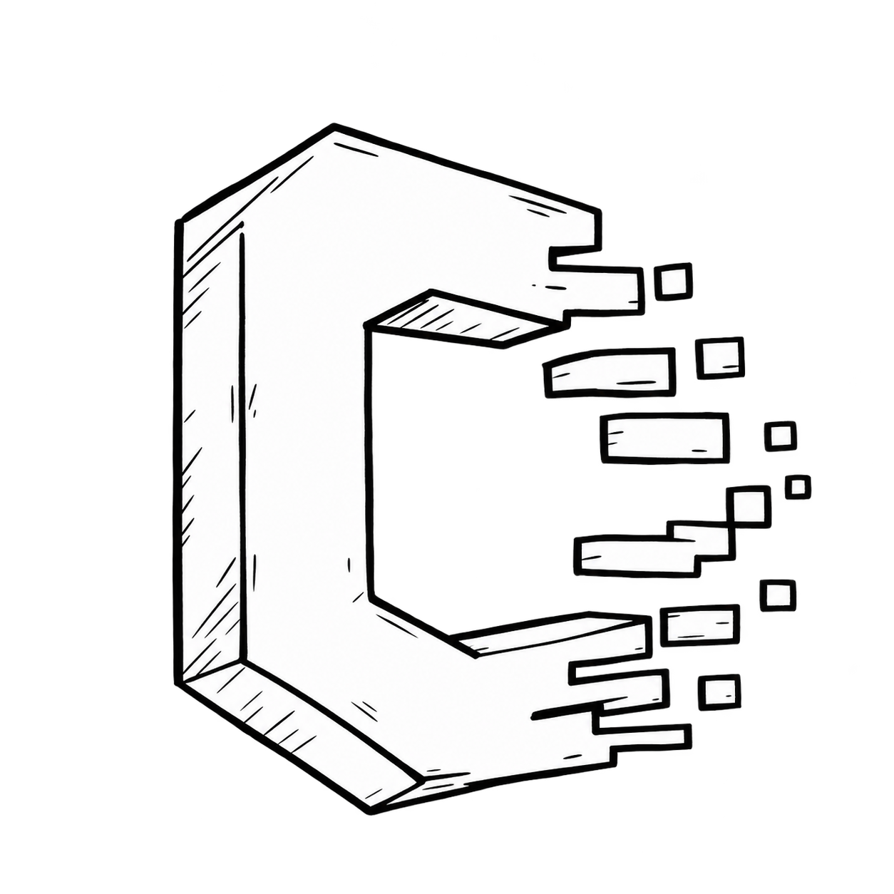

<div align="center">



# CLEANSLATE

### **WIPE THE TRACE. KEEP THE CONTROL.**

A privacy-first browser extension for reviewing and removing **your own Facebook & Messenger activity** — directly in your browser, using Facebook's native controls.

<br>

[](#-privacy-by-design)
[](#-privacy-by-design)
[](https://github.com/Tajwarbot/CleanSlate)
[](#-development)

</div>

---

> **CLEAN YOUR DIGITAL FOOTPRINT.**
>
> CleanSlate helps you review the activity attached to your Facebook account and remove it through the controls Facebook already provides.
>
> **No Facebook access token. No external Facebook API. No remote cleanup service.**

---

## ◼ WHAT IT DOES

CleanSlate is built around one simple idea:

**your activity should stay under your control.**

It guides the browser through Facebook's own Activity Log and Messenger interfaces so you can review and remove supported activity without handing your account data to another service.

### CURRENTLY TARGETED

| AREA | CLEANUP |
|---|---|
| Facebook Activity | Review & remove supported activity |
| Likes / reactions | Review & remove through Facebook controls |
| Comments | Review & remove through Facebook controls |
| Page likes / follows | Review & remove where Facebook exposes the control |
| Messenger | Guided cleanup of supported conversations/messages |
| Preview mode | Inspect before anything is removed |

> Facebook changes its UI frequently. CleanSlate is designed to work with the controls Facebook actually renders rather than relying on undocumented APIs.

---

## ◼ WHY CLEANSLATE

### 01 — LOCAL
Your Facebook activity is inspected in your logged-in browser tab.

### 02 — NO FACEBOOK API
CleanSlate does **not** use a Facebook access token or external Facebook API.

### 03 — SAFETY FIRST
Preview mode lets you inspect what was found before removal actions are allowed.

### 04 — HUMAN CONTROL
The extension does not silently bypass browser security or Facebook confirmation flows.

### 05 — OPEN SOURCE
The code is public. You can inspect how the extension works, build it yourself, and contribute.

---

## ◼ SAFETY PREVIEW

**USE THIS FIRST.**

Safety Preview Mode is designed to let you verify the loaded activity before any removal action is taken.

```text
┌─────────────────────────────────────────────┐
│  CLEANSLATE / SAFETY PREVIEW               │
├─────────────────────────────────────────────┤
│                                             │
│  TARGET       FACEBOOK ACTIVITY             │
│  FOUND        137 ITEMS                     │
│                                             │
│  ✓ LIKES                                     │
│  ✓ COMMENTS                                  │
│  ✓ REACTIONS                                 │
│  ✓ FOLLOWS                                   │
│                                             │
│  [ PREVIEW ]       [ REMOVE ]               │
│                                             │
│  REMOVAL LOCK: ON                            │
└─────────────────────────────────────────────┘
```

When Safety Preview is enabled, CleanSlate **does not click Facebook's Remove button**.

When you choose to perform cleanup, review the loaded activity and Facebook's confirmation controls carefully.

**Some Facebook cleanup actions may be irreversible.**

---

## ◼ INSTALL

### OPTION A — GITHUB RELEASE

No Node.js or programming knowledge is required.

1. Open the **[Releases](https://github.com/Tajwarbot/CleanSlate/releases)** page.
2. Download the latest `cleanslate-vX.Y.Z.zip`.
3. Extract the ZIP to a permanent folder.
4. Open your browser's extension page:
   - Chrome → `chrome://extensions`
   - Brave → `brave://extensions`
   - Edge → `edge://extensions`
5. Enable **Developer mode**.
6. Select **Load unpacked**.
7. Choose the extracted folder containing `manifest.json` — normally `dist`.
8. Pin CleanSlate to your toolbar.
9. Open Facebook or Messenger and launch CleanSlate.

> **Why are there manual browser clicks?**
>
> Chromium browsers intentionally prevent websites, GitHub pages, scripts, and ZIP files from silently enabling Developer Mode or installing unpacked extensions. CleanSlate cannot — and should not — bypass those protections.

---

## ◼ BUILD FROM SOURCE

For contributors and users who want to build CleanSlate themselves.

### REQUIREMENTS

- Node.js **20+**
- Chrome, Brave, Edge, or another Chromium-based browser

### BUILD

```bash
git clone https://github.com/Tajwarbot/CleanSlate.git
cd CleanSlate

npm install
npm run build
```

Then load the generated `dist` directory:

```text
Browser
  └── Extensions
       └── Developer mode: ON
            └── Load unpacked
                 └── CleanSlate/dist
```

### PACKAGE

```bash
npm run package
```

The versioned ZIP is written to:

```text
release/cleanslate-vX.Y.Z.zip
```

---

## ◼ DEVELOPMENT

| COMMAND | PURPOSE |
|---|---|
| `npm run build` | Type-check and build into `dist` |
| `npm run package` | Build a versioned release ZIP |
| `npm run typecheck` | Run TypeScript checking |
| `npm test` | Run the test suite |

---

## ◼ PRIVACY BY DESIGN

CleanSlate is intentionally designed around a small trust boundary.

```text
┌──────────────────┐
│   YOUR BROWSER   │
│                  │
│  Facebook tab    │
│       │          │
│       ▼          │
│   CLEANSLATE     │
│       │          │
│       ▼          │
│ Facebook native  │
│    controls      │
└──────────────────┘
          │
          X
   No external cleanup
      server required
```

### CleanSlate does NOT:

- use a Facebook access token
- call an external Facebook API
- upload your activity to a cleanup server
- require a CleanSlate account for basic use
- silently install itself
- bypass browser security controls

### CleanSlate DOES:

- operate in your logged-in browser
- inspect Facebook/Messenger pages you have access to
- use Facebook's rendered controls
- keep local extension state in browser storage
- require explicit user action for cleanup

---

## ◼ IMPORTANT LIMITATIONS

CleanSlate is **not** a magic eraser for everything Facebook has ever stored.

Facebook controls what can be viewed and removed through its interfaces. UI changes, account states, regional differences, permissions, loading behavior, and platform limitations can affect what CleanSlate can detect or remove.

**If Facebook does not expose a supported control, CleanSlate cannot safely invent one.**

---

## ◼ CONTRIBUTING

Pull requests, bug reports, UI updates, and compatibility improvements are welcome.

If Facebook changes an Activity Log or Messenger flow:

1. Open an issue with the affected flow.
2. Include the browser and relevant page/category.
3. Describe what changed.
4. Avoid posting private account data or screenshots containing sensitive information.

See the repository's contribution and security guidance before submitting changes.

---

## ◼ SECURITY

Found a security issue?

Please use the repository's security reporting process rather than publicly posting sensitive details in an issue.

Never share:

- Facebook passwords
- access tokens
- session cookies
- private messages
- personal account data

---

## ◼ ROADMAP

CleanSlate is being built around a deliberately narrow principle:

> **Automate the boring parts. Keep the dangerous parts visible.**

Possible future work includes:

- broader activity categories
- improved Facebook UI detection
- more Messenger cleanup flows
- better progress reporting
- stronger dry-run / preview tooling
- cross-browser compatibility improvements
- more automated regression tests

---

<div align="center">

## CLEANSLATE

**DELETE THE TRACE. KEEP THE DATA PRIVATE.**

[Repository](https://github.com/Tajwarbot/CleanSlate) · [Issues](https://github.com/Tajwarbot/CleanSlate/issues) · [Releases](https://github.com/Tajwarbot/CleanSlate/releases)

<br>

`OPEN SOURCE` · `LOCAL FIRST` · `USER CONTROLLED`

</div>
